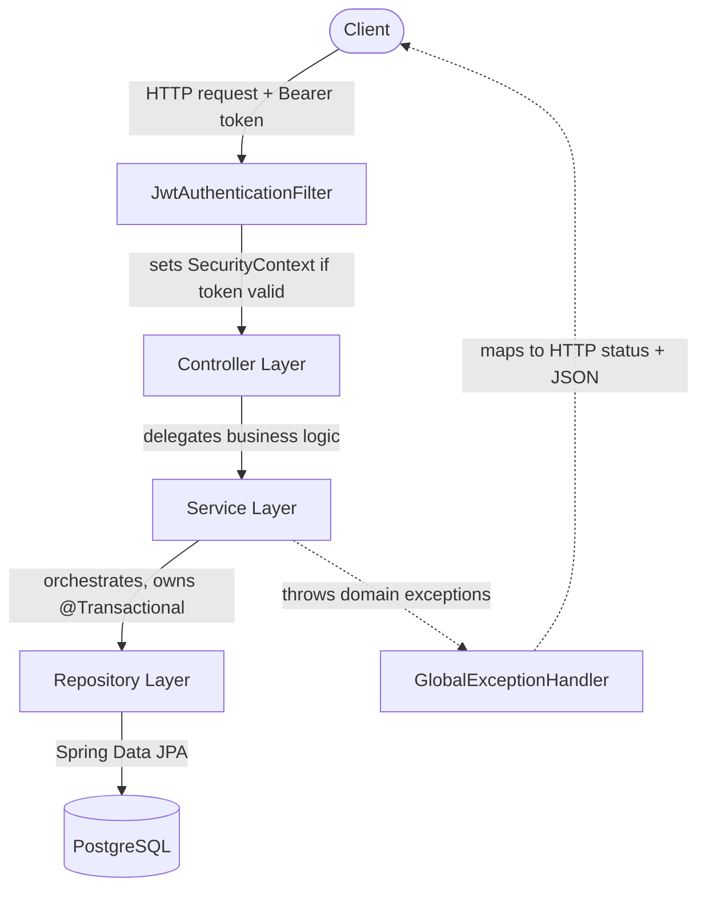

# Core Banking API

A RESTful banking API built with Spring Boot 4.1 and Java 25, implementing customer registration, account management, and transaction processing with stateless JWT authentication and role-based authorization.

Built as a portfolio project to demonstrate production-grade backend engineering practices: layered architecture, transactional integrity, secure authentication, and defensible design tradeoffs.

**🔗 Live Demo:** https://core-banking-api-0chu.onrender.com/swagger-ui.html

*Hosted on Render's free tier — the app sleeps after ~15 minutes of inactivity. The first request after waking can take up to ~60 seconds. Hit the link once before demoing live.*

## Business Use Case

Retail banking APIs sit at the center of real financial risk: incorrect balance updates, replayed transactions, or leaked credentials translate directly into monetary loss and regulatory exposure. This project simulates that environment end-to-end rather than a simplified CRUD demo:

- **Customer onboarding** with hashed credentials, never stored or returned in plaintext.
- **Account and transaction management** where every balance change is atomic and auditable — a failed transaction leaves no partial trace.
- **Tiered access**, distinguishing ordinary customers from administrative staff who can view system-wide account data.
- **Safe retry behavior**, so a client-side network failure during a deposit or withdrawal cannot silently double-charge a customer.

The engineering decisions throughout — BigDecimal for money, transactional boundaries, idempotency keys, stateless JWT auth — were chosen to hold up under the same correctness and security expectations a real banking backend would be judged against.

## Tech Stack

- **Language/Runtime:** Java 25 (Microsoft build)
- **Framework:** Spring Boot 4.1.0 (Web MVC, Data JPA, Security, Validation)
- **Database:** PostgreSQL 17 (Neon, serverless, in production)
- **Auth:** JWT (JJWT 0.12.6), BCrypt password hashing
- **Mapping:** MapStruct 1.6.3
- **Build:** Maven
- **Deployment:** Docker, Render

## Architecture

Requests flow through a strict layered architecture. Each layer has exactly one responsibility, which keeps business logic, HTTP concerns, and persistence independently testable and replaceable.



The JWT filter sits **before** Spring MVC's controller dispatch, in the servlet filter chain itself — not inside a controller or service. This means authentication happens before a request ever reaches business logic, and authorization (`@PreAuthorize`) is enforced declaratively at the controller method level rather than scattered through service code.

## Key Design Decisions

Every non-obvious choice below was made deliberately, with a tradeoff considered. This project prioritizes being able to defend decisions, not just make them.

### Money as `BigDecimal`, not `double`
Floating-point binary representation cannot exactly represent most decimal fractions (e.g. `10.01` has no exact binary form), which compounds into real errors across many transactions. `BigDecimal` with `precision=19, scale=2` (mapped to Postgres `numeric(19,2)`) avoids this entirely. The tradeoff: `BigDecimal` is immutable, so every arithmetic operation allocates a new object — a real but acceptable cost for correctness in a financial system.

### DTOs, never entities, over the wire
Entities are never serialized directly to JSON. Two reasons: bidirectional JPA relationships risk infinite recursion (`Account` → `Customer` → `Account` → ...) causing a `StackOverflowError`, and even one-directional relationships risk leaking more data than intended (e.g. a full `Customer` record nested inside an `Account` response). MapStruct generates the entity-DTO mapping code at compile time, so mapping bugs are caught by the compiler, not at runtime.

### `@Transactional` lives on the Service layer
Deposit and withdrawal both touch two tables (`accounts` balance update, `transactions` insert) that must succeed or fail together. `@Transactional` is placed on the Service method — the layer actually orchestrating multiple repository calls — not the Controller (which shouldn't know about persistence boundaries) or the Repository (which only knows about one table at a time). This was proven, not just asserted: a failed withdrawal for insufficient funds was verified via direct `psql` query to leave **zero** orphaned transaction rows.

### Password hashing with BCrypt
Passwords are hashed with `BCryptPasswordEncoder` before storage — a one-way transformation. If the database leaks, an attacker gets hashes requiring brute-force effort per password, not directly usable credentials (which is what a plaintext or reversibly-encrypted leak would hand them).

### Stateless JWT authentication
No server-side session is created or stored. All identity and authorization data (`sub`, `role`, `exp`) lives inside the signed token itself. The signature (`HMAC-SHA256`, keyed by a server-only secret) guarantees **integrity** — the payload can't be silently modified — but deliberately does not provide **confidentiality** (the payload is Base64-encoded, not encrypted, and readable by anyone) or **theft protection** (a stolen-but-unmodified token is indistinguishable from a legitimate one). This is why token expiry (15 minutes) and HTTPS in transit both matter — they're the mitigations for what signing alone doesn't cover.

### Role embedded in the token, not looked up per-request
A customer's `Role` (`CUSTOMER` / `ADMIN`) is embedded directly in the JWT payload at login, rather than queried from the database on every authenticated request. This preserves statelessness — no DB round-trip needed just to check a role — but has a real, deliberate tradeoff: **a role change (e.g. promoting a customer to admin) does not take effect until that customer's next login**, since their currently-held token is already stale the moment the database row changes. The 15-minute expiry bounds how long staleness can persist.

### Account enumeration prevention on login
`/auth/login` returns the identical `401` response — same status, same generic message — whether the email doesn't exist or the password is wrong. This prevents an attacker from using response differences to discover which emails are registered customers.

## Known Tradeoffs (Documented, Not Fixed)

Being upfront about limitations is part of the engineering discipline here — each of these was a deliberate cost/benefit call, not an oversight.

| Decision | Portfolio Context | Production Alternative |
|---|---|---|
| `spring.jpa.hibernate.ddl-auto=update` | Fine for iterating locally and for a first deployment | Flyway or Liquibase migrations |
| DB credentials via environment variables with local fallback defaults | Appropriate for a single-developer portfolio; never committed as real secrets | Secrets manager (AWS Secrets Manager, Vault) |
| `JWT_SECRET` via environment variable (Codespaces locally, Render in production) | Never committed to git in either environment; each environment holds its own independent secret | Dedicated secrets manager with rotation |
| Missing endpoints return `403` instead of `401` | Spring Security only emits `401` when a custom `AuthenticationEntryPoint` is registered; this project never configured one | Register a custom entry point to distinguish "not authenticated" from "authenticated, wrong role" |
| No admin-promotion endpoint | Roles are promoted via a direct SQL `UPDATE` on the database | A dedicated, itself-`@PreAuthorize`-protected admin endpoint |
| Free-tier hosting cold starts | Render's free web service sleeps after ~15 minutes idle; first request after waking is slow | A paid always-on instance |

## Demo Walkthrough

The live Swagger UI (linked above) is the fastest way to see this working end-to-end.

1. **Wake the service** — open the [live demo link](https://core-banking-api-0chu.onrender.com/swagger-ui.html) a minute or two before demoing, since the free tier cold-starts after idling.
2. **Register a customer** — expand `POST /customers`, try it out with a sample body, execute. Defaults to `CUSTOMER` role.
3. **Log in** — expand `POST /auth/login` with the same credentials, execute, copy the returned token.
4. **Authorize** — click the **Authorize** button (top of page), paste the token, confirm.
5. **Create an account** — `POST /accounts` with the customer's ID.
6. **Deposit funds** — `POST /accounts/deposit` with the account ID and an amount.
7. **Try the admin-only endpoint while still a `CUSTOMER`** — `GET /accounts/admin/all-accounts` correctly returns `403 Forbidden`.
8. **Promote to admin** — this requires direct database access (see Known Tradeoffs above); not exposed via the API by design.
9. **Log in again** for a fresh token carrying the updated role, re-authorize, and retry step 7 — now returns `200` with the full account list.

This sequence demonstrates registration, authentication, atomic transactions, and role-based authorization all in one pass.

## API Reference

| Method | Endpoint | Auth Required | Description |
|---|---|---|---|
| POST | `/customers` | No | Register a new customer (defaults to `CUSTOMER` role) |
| POST | `/auth/login` | No | Authenticate, receive a JWT |
| GET | `/customers/me` | Yes (any role) | Get the authenticated customer's own profile |
| POST | `/accounts` | Yes | Create an account for a customer |
| GET | `/accounts/admin/all-accounts` | Yes (`ADMIN` only) | List every account in the system |
| POST | `/accounts/deposit` | Yes | Deposit into an account (atomic) |
| POST | `/accounts/withdraw` | Yes | Withdraw from an account (atomic, rejects insufficient funds) |
| GET | `/accounts/{accountId}/transactions` | Yes | Transaction history for an account |

All error responses follow a consistent shape:
```json
{
  "timestamp": "2026-09-17T09:08:57Z",
  "status": 404,
  "error": "Not Found",
  "message": "Customer not found: 99"
}
```

## Running Locally

```bash
docker start banking-postgres
./mvnw spring-boot:run
```

Requires a `JWT_SECRET` environment variable (a 64-byte random value, Base64-encoded) and a running PostgreSQL instance matching the credentials in `application.properties`.

## Running with Docker

```bash
docker build -t core-banking-api .
docker run -p 8080:8080 \
  -e JWT_SECRET=<your-secret> \
  -e DATABASE_URL=jdbc:postgresql://<host>:5432/<db> \
  -e DATABASE_USERNAME=<user> \
  -e DATABASE_PASSWORD=<password> \
  core-banking-api
```
